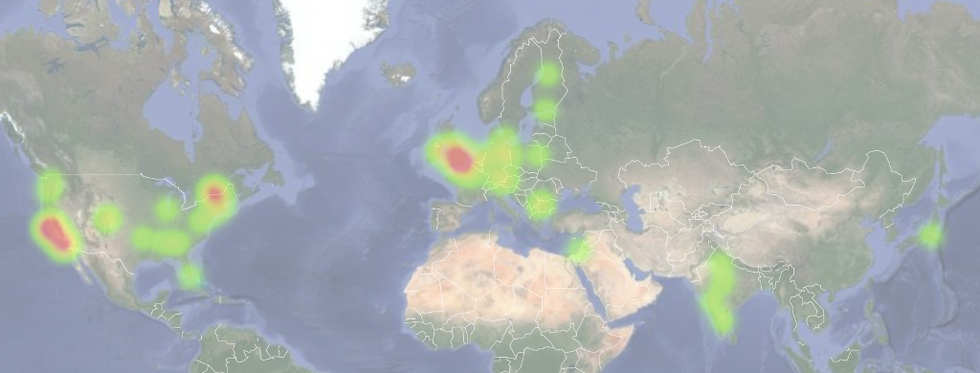

# Gerrit User Summit is *THE event of the year* for the Community.

We will bring together Gerrit thought leaders, developers, practitioners,
the whole community and ecosystem, in one event, providing attendees
with the opportunity to learn, explore, network face-to-face and help
shape the future of Gerrit development and solutions.

*** promo
[Register Now to the Gerrit User Summit 2017](https://www.eventbrite.co.uk/e/gerrit-user-summit-2017-tickets-34486175078)
***

# Gerrit User Summit 2017 - Sept 30th to Oct 3rd, London (UK)

| Sep 30th - Oct 1st | Oct 2nd - 3rd     |
|--------------------|-------------------|
| 2 days Hackathon   | 2 days Conference |

# Why a Gerrit User Summit in Europe?

We want to engage with a *wider and more diverse community*, who can bring
new requirements and needs from of the European Gerrit Community;
an opportunity to *see more faces and get new ideas*.
From a poll for the Gerrit community here’s what we found out that some
70% of the polled base would participate in a London event. There is clearly
a meaningful part of the Gerrit use base that is European based and not served
well by the US based events.

**Gerrit interest and adoption around the world**

See below a heatmap of the results of the polls on the interest of having a Gerrit User Summit this year.

