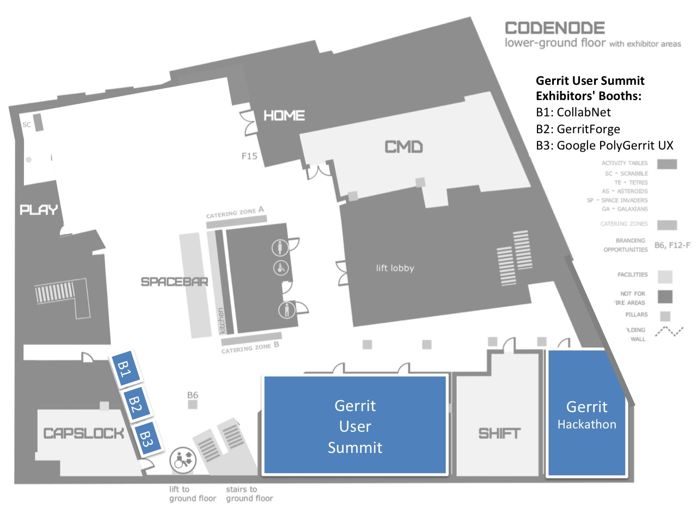

# Gerrit User Summit 2017 - Location

## Hosted by Skills Matter - CodeNode

The Hackathon and User Summit are hosted by [Skills Matter at CodeNode](https://skillsmatter.com/contact-us)
in the lower-ground floor dedicated to meetups and conferences.

Opened in August 2015 and sponsored by major IT companies such as IBM and Google. CodeNode is a 23,000 sqft
Tech Events and Community venue. CodeNode provides fantastic meetup, conference, training and collaboration
spaces with unique technology capabilities for our tech, digital and developer communities.

CodeNode features a 5,000 sqft break-out space, complete with fully-licensed bar, plenty of power sockets,
meeting and collaboration spaces and entertainment areas.

## Hotels and Places to Stay

CodeNode and SkillsMatter have discounts for the nearby hotels.
See more details at the [CodeNode Hotels and Places to Stay web page](https://skillsmatter.com/contact-us#hotels).

## Getting there

*By Car*

If you want to commute by car to CodeNode, NCP Finsbury Square offers an ideal parking spot.
Located beneath the lawn bowls green you're only a short walk from CodeNode, Moorgate and Old Street.

You can also check out Parkopedia for details of nearby parking.

*By Bike*

For cycling directions, check out a bike map around CodeNode.

During an event, you can store your bicycle at the reception area, but please let one of our staff know on arrival.
Please note that your bike will be left at your own risk.

If you are arriving or departing using a [Santander Cycles Hire bike](https://www.santandercycleslondon.co.uk/), there is a docking station right
outside our venue on South Place.

*By Underground*

The nearest Underground stations are Moorgate and Liverpool Street stations.
Both are on the Circle, Metropolitan and Hammersmith & City lines, Moorgate is also on the Northern Line and Liverpool Street
on the Central line. Liverpool Street is also the main overland station. Other Underground stations nearby are Old Street and Barbican.

To reach CodeNode from Moorgate Station, exit Moorgate station, turn right onto Moorgate, turn right again onto South Place.
Walk down on South Place until you reach number 10 on your right.

## Inside CodeNode, lower-ground floor map

See below the map of the CodeNode lower ground floor where the Hackathon & User Summit will take place.
There will be roll-up banners at the entrance of CodeNode and in front of the Conference Room used for the two days event.

