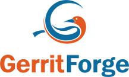

# Sponsors

## Gold

[CollabNet](http://www.collab.net)

CollabNet is the leading partner for Secure DevOps of Enterprise and Federal Applications. Increase the speed and quality of software development and operations with CollabNet’s connected solutions.

[GerritForge](http://www.gerritforge.com)

GerritForge is one of the main contributors of Gerrit Code Review and provides LDAP integration, Single-Sign-On, Role-Based Access Control, Lifecycle Integration with a Enterprise-grade Support 24x7
for medium and large installations.

## Silver

[SkillsMatter](http://skillsmatter.com)

Skills Matter was founded to help drive innovation in software engineering by bringing smart and creative developers together to learn and share new skills, discover emerging technologies and evolve practices and ideas.

